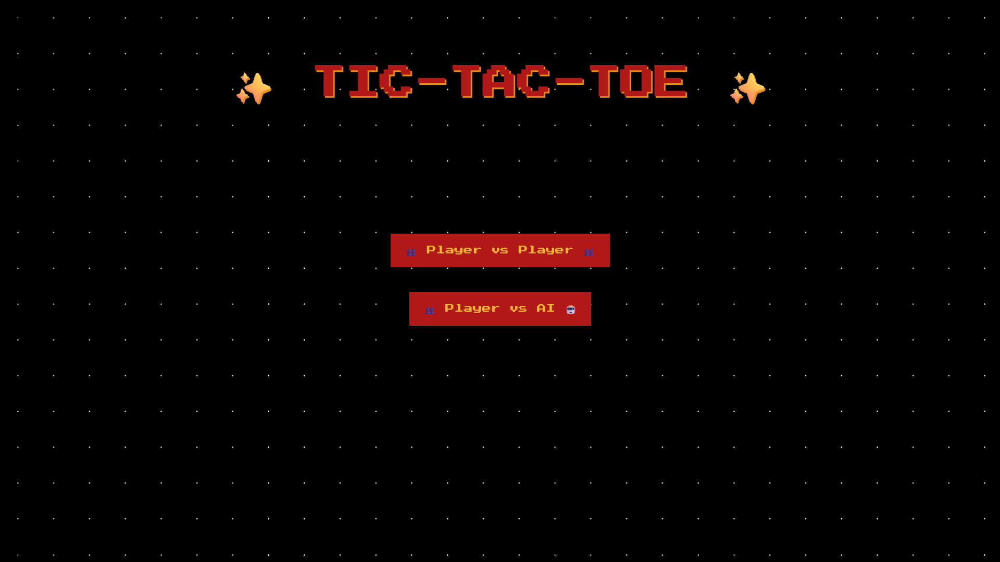
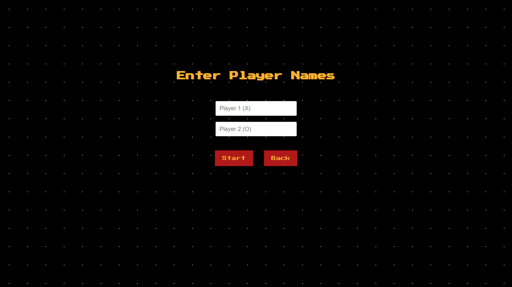
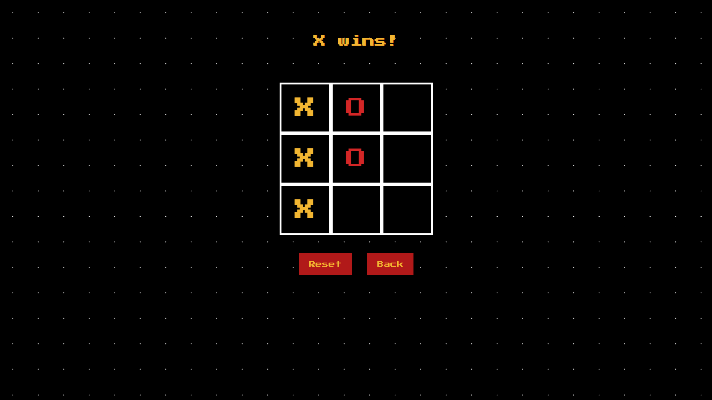
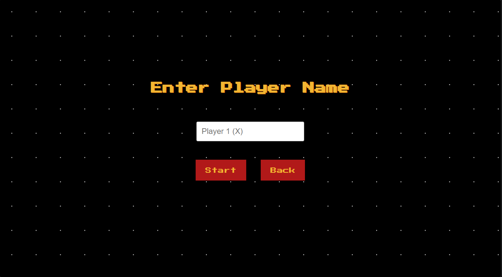
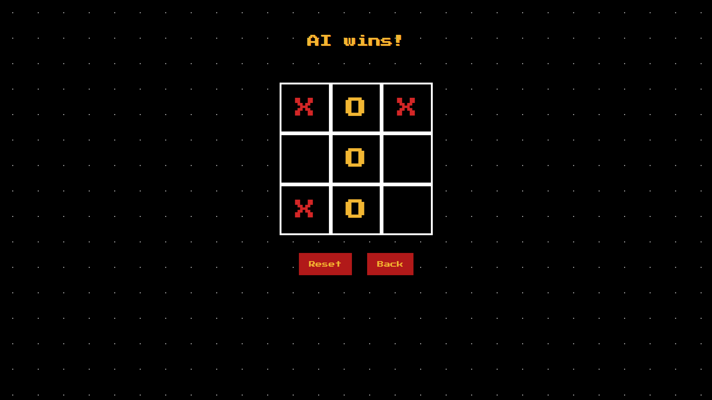

# ✨ Tic-Tac-Toe ✨

A retro-styled tic-tac-toe game built with React and Vite, featuring both Player vs Player and Player vs AI game modes.

## 📸 Screenshots

### Main Menu


### Player vs Player



### Player vs AI



## ✨ Key Features

- **Two Game Modes**
  - 👥 Player vs Player - Play with a friend locally
  - 🤖 Player vs AI - Challenge the computer
  
- **Custom Player Names** - Personalize your gaming experience

- **Winning Highlight** - Visual feedback for winning combinations

- **Retro Aesthetic** - Arcade-style design with pixel font and dotted grid background

- **Reset & Navigation** - Easy game reset and menu navigation

- **Responsive UI** - Clean and intuitive interface

## 🛠️ Tech Stack

- **React** 19.1.0 - UI library
- **Vite** 6.3.5 - Build tool and dev server
- **CSS3** - Custom retro styling
- **ESLint** - Code linting

## 📋 Prerequisites

Before running this project, make sure you have:

- **Node.js** (v16 or higher recommended)
- **npm** or **pnpm** (package manager)

## 🚀 Installation

1. Clone the repository
```bash
git clone https://github.com/hotsummerz/tic-tac-toe.git
cd tic-tac-toe
```

2. Install dependencies
```bash
npm install
# or
pnpm install
```

## ▶️ How to Run

### Development Mode
```bash
npm run dev
```
The app will open at `http://localhost:5173`

### Build for Production
```bash
npm run build
```

### Preview Production Build
```bash
npm run preview
```

### Lint Code
```bash
npm run lint
```

## 🎮 How to Play

1. **Select Game Mode**
   - Choose between Player vs Player or Player vs AI

2. **Enter Player Names**
   - Input your name(s) for a personalized experience

3. **Make Your Move**
   - Click on any empty square to place your mark (X or O)
   - Player 1 is always X, Player 2/AI is always O

4. **Win Conditions**
   - Get three of your marks in a row (horizontal, vertical, or diagonal)
   - The winning line will be highlighted
   - If all squares are filled with no winner, it's a draw

5. **Reset or Go Back**
   - Use the Reset button to start a new round
   - Use the Back button to return to the menu

## 🤖 AI Behavior

The AI opponent uses a random move selection strategy:
- Selects from available empty squares
- 800ms delay for natural gameplay feel
- Always plays as "O" (Player 2)

## 📝 License

This project is open source and available for educational purposes.

## 👨‍💻 Author

Created as part of Algorithm and Programming coursework (Semester 2)

---

**Enjoy the game!** 🎮✨
